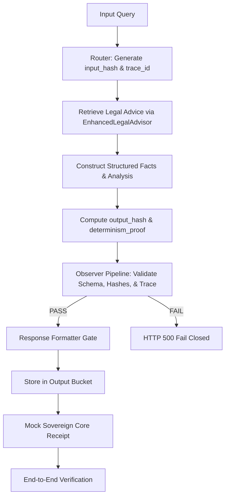

# TANTRA Convergence Review Packet — Raj Prajapati

This review packet documents the canonical convergence of NYAI as a deterministic, non-bypassable intelligence module integrated inside the TANTRA flow.

---

## 1. System Entry Point

The core entry point for all legal query processing is:
- **Endpoint**: `POST /nyaya/query`
- **File Link**: [api/router.py](file:///c:/Users/Gauri/Desktop/NYAI-Integrated/backend/api/router.py)

---

## 2. Core Files Changed / Created

### Schema and Validation Layer
- **[api/schemas.py](file:///c:/Users/Gauri/Desktop/NYAI-Integrated/backend/api/schemas.py)**: Define canonical Pydantic schemas. Includes the `RecommendationType` enum, structured `Fact`, `RuleApplication`, and `ExplanationStep` models, and hex64 format validation for `DeterminismProof`.
- **[api/response_builder.py](file:///c:/Users/Gauri/Desktop/NYAI-Integrated/backend/api/response_builder.py)**: Formatter gate that enforces schema formatting, throws `SchemaValidationError`, `HashMismatchError`, or `TraceContinuityError` upon validation failure. **Fail-closed by construction.**
- **[observer/pipeline.py](file:///c:/Users/Gauri/Desktop/NYAI-Integrated/backend/observer/pipeline.py)**: The independent Observer Pipeline validating output structure, checking trace continuity and hashes, and generating `ObserverValidationResult`.

### Integration & Execution
- **[api/router.py](file:///c:/Users/Gauri/Desktop/NYAI-Integrated/backend/api/router.py)**: Main query router updated to invoke `EnhancedLegalAdvisor` with the same `trace_id`, calculate hashes, build structured elements, invoke the observer gate, and forward logs to the output bucket.
- **[api/main.py](file:///c:/Users/Gauri/Desktop/NYAI-Integrated/backend/api/main.py)**: Added global exception handlers to return standard JSON 500 errors upon TANTRA schema validation or trace failure (ensuring fail-closed behavior).

### TANTRA Flow Modules (New)
- **[tantra/output_bucket.py](file:///c:/Users/Gauri/Desktop/NYAI-Integrated/backend/tantra/output_bucket.py)**: Append-only ledger validating and storing final responses.
- **[tantra/sovereign_core_mock.py](file:///c:/Users/Gauri/Desktop/NYAI-Integrated/backend/tantra/sovereign_core_mock.py)**: Receives, inspects, and acknowledges NYAI outputs.
- **[tantra/flow.py](file:///c:/Users/Gauri/Desktop/NYAI-Integrated/backend/tantra/flow.py)**: End-to-end flow runner representing: `Input → NYAI → Sovereign Core → Output Bucket → Verification`.

---

## 3. What Changed (Convergence vs Legacy)

1. **Complete Removal of Enforcement Layer**:
   - Deleted the `enforcement_engine` directory.
   - Removed any occurrences of `ALLOW`, `BLOCK`, `SAFE_REDIRECT`, or `enforcement_decision` usage.
2. **Advisory-Only Recommendation**:
   - `RecommendationType` is restricted to: `INFORM / REVIEW / ESCALATE / INSUFFICIENT_DATA` (no semantic bias or policy enforcement).
3. **Structured Fields**:
   - `facts` converted from strings to list of `Fact` objects (`{fact_id, statement, source}`).
   - `rule_application` converted from strings to list of `RuleApplication` objects (`{law_id, application}`).
   - `explanation_chain` converted from strings to list of `ExplanationStep` objects (`{step_number, description, source}`).
4. **Deterministic and Immutable Continuity**:
   - `request_id` derived deterministically as `f"req_{input_hash[:12]}"`.
   - `input_hash` derived from sorting and hashing the canonical incoming payload.
   - Passed `trace_id` down through all advisor contexts to prevent trace mutations.

---

## 4. Live Flow Overview



---

## 5. Failure Cases & Error Handling

To achieve the non-bypassable and fail-closed requirements, the system does not degrade gracefully. It raises high-level HTTP 500 exceptions in the following situations:
- **`SchemaValidationError`**: Raised when any of the 11 required canonical fields are missing, typed incorrectly, or formatted wrong (e.g. invalid recommendation type or unstructured facts).
- **`HashMismatchError`**: Raised if the observer detects a mismatch between response-level hashes and proof-level hashes.
- **`TraceContinuityError`**: Raised if the trace ID at response time differs from the trace ID generated at receipt time.

---

## 6. Execution Proof (3 Identical Runs)

The following output verifies determinism across three consecutive requests with the query `"theft of mobile phone"`:

```text
=== Run 1 ===
  input_hash:         780eafc1be76cfb8cb22ea90bfc20e01ec2b5e27a26de424f69ba0038e804330
  output_hash:        461b94d02f3b43ab3769ab88ad37d4fce9822095cf24cd0feec44abca095d1c6
  version:            3.0.0
  recommendation:     type=INFORM, confidence=0.75
  legal_context:      {'jurisdiction': 'IN', 'domain': 'criminal', 'applicable_laws': ['Indian Penal Code']}
  facts:              5 items, structured=True
  rule_application:   2 items, structured=True
  explanation_chain:  8 steps, structured=True
  risk_flags:         []
  observer_status:    PASS
  determinism_ok:     True
  trace_continuity:   True
  schema_valid:       True
  metadata.schema:    tantra_v3

=== Run 2 ===
  input_hash:         780eafc1be76cfb8cb22ea90bfc20e01ec2b5e27a26de424f69ba0038e804330
  output_hash:        461b94d02f3b43ab3769ab88ad37d4fce9822095cf24cd0feec44abca095d1c6
  version:            3.0.0
  recommendation:     type=INFORM, confidence=0.75
  legal_context:      {'jurisdiction': 'IN', 'domain': 'criminal', 'applicable_laws': ['Indian Penal Code']}
  facts:              5 items, structured=True
  rule_application:   2 items, structured=True
  explanation_chain:  8 steps, structured=True
  risk_flags:         []
  observer_status:    PASS
  determinism_ok:     True
  trace_continuity:   True
  schema_valid:       True
  metadata.schema:    tantra_v3

=== Run 3 ===
  input_hash:         780eafc1be76cfb8cb22ea90bfc20e01ec2b5e27a26de424f69ba0038e804330
  output_hash:        461b94d02f3b43ab3769ab88ad37d4fce9822095cf24cd0feec44abca095d1c6
  version:            3.0.0
  recommendation:     type=INFORM, confidence=0.75
  legal_context:      {'jurisdiction': 'IN', 'domain': 'criminal', 'applicable_laws': ['Indian Penal Code']}
  facts:              5 items, structured=True
  rule_application:   2 items, structured=True
  explanation_chain:  8 steps, structured=True
  risk_flags:         []
  observer_status:    PASS
  determinism_ok:     True
  trace_continuity:   True
  schema_valid:       True
  metadata.schema:    tantra_v3

=== DETERMINISM CHECK ===
PASS: All 3 runs produced identical hashes
  input_hash:  780eafc1be76cfb8cb22ea90bfc20e01ec2b5e27a26de424f69ba0038e804330
  output_hash: 461b94d02f3b43ab3769ab88ad37d4fce9822095cf24cd0feec44abca095d1c6
```
